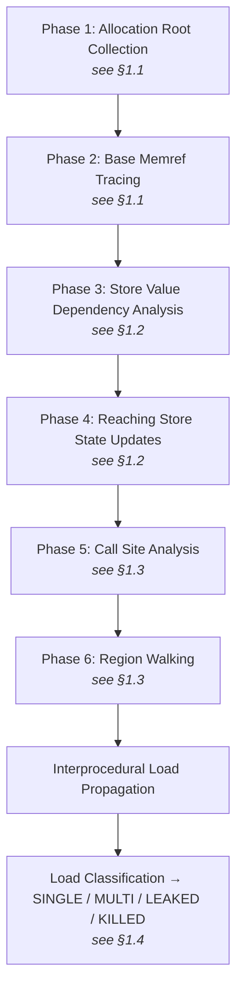
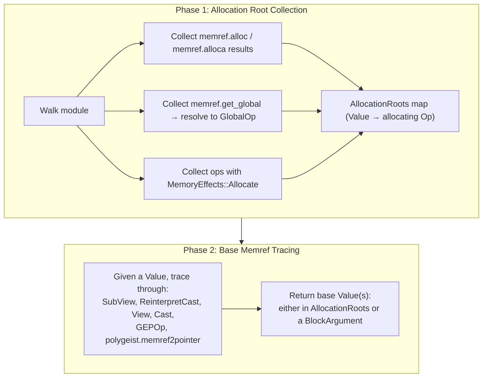
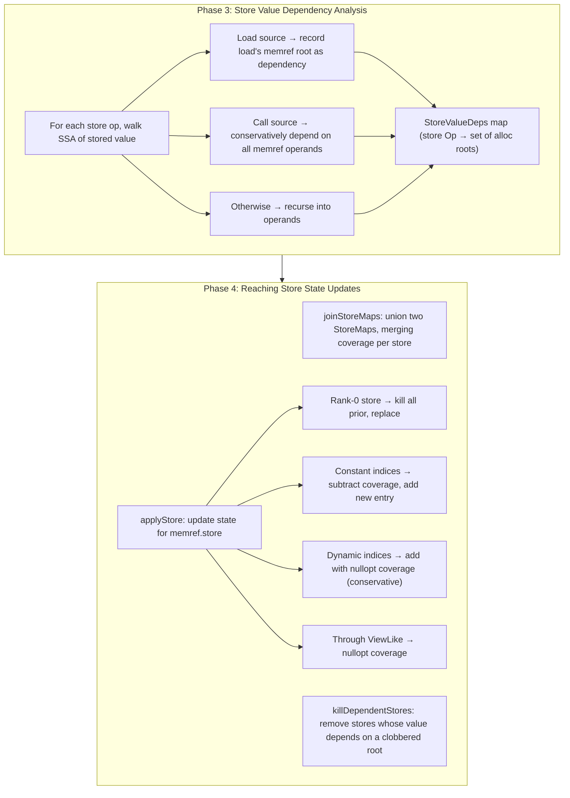
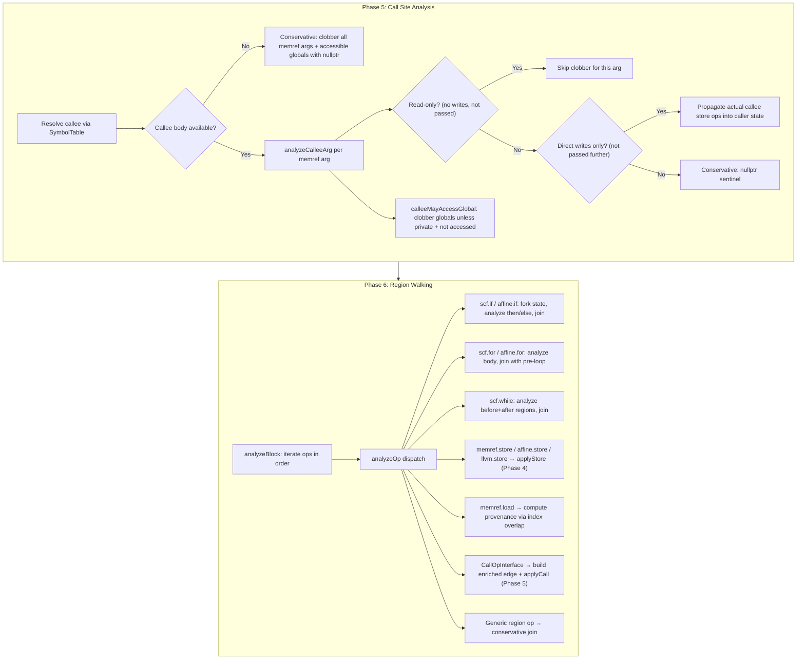
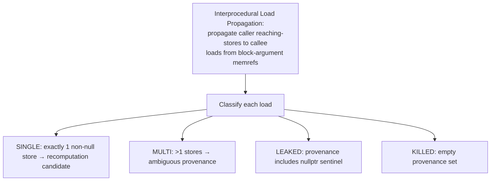
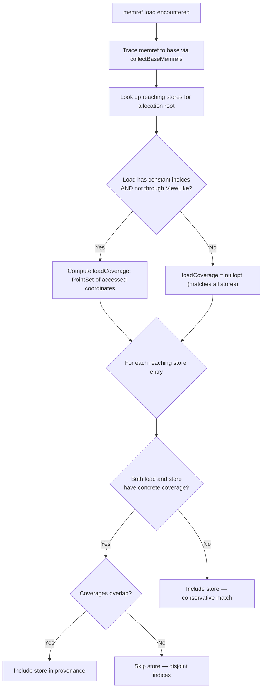
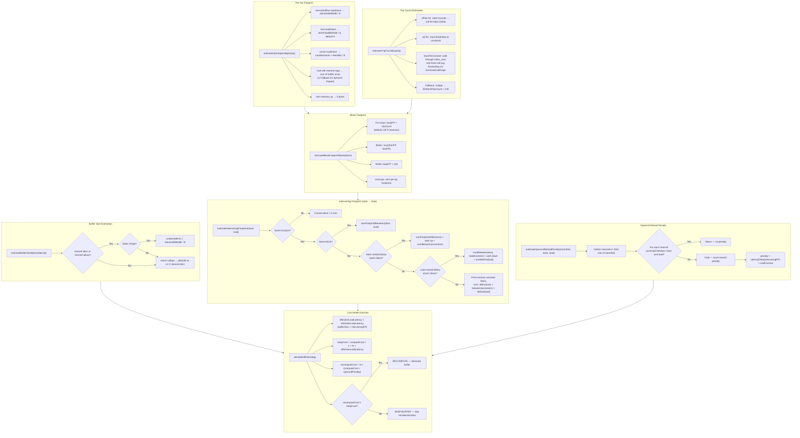
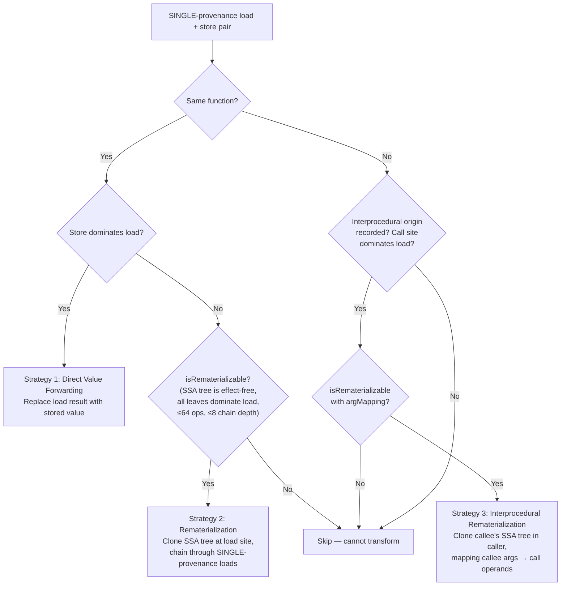
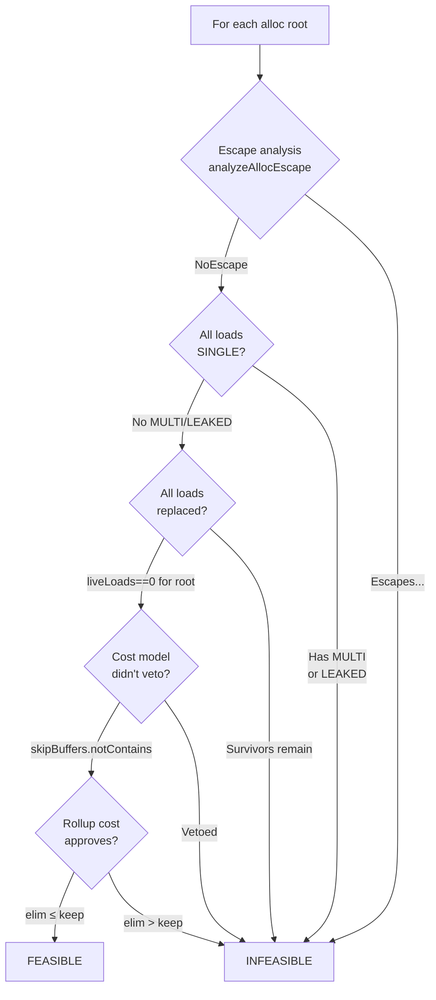

# Data Recomputation Pass: Analysis & Improvement Plan

## 1. Recomputation Candidate Identification

The pass identifies loads that can be replaced with recomputed values through a 6-phase reaching-stores analysis, followed by classification and transformation.

### Phase Pipeline Overview



### 1.1 Phases 1–2: Root Collection and Memref Tracing



### 1.2 Phases 3–4: Dependency Analysis and State Updates



### 1.3 Phases 5–6: Call Site Analysis and Region Walking



### 1.4 Load Classification



### Load Provenance Resolution (Index-Sensitive)

For `memref.load` ops (not `affine.load` or `llvm.load`, which are handled conservatively), the pass performs index-sensitive matching:



## 2. Cache Footprint Analysis

The footprint analysis estimates the memory traffic between a store and its consuming load to determine whether the stored value is likely still in cache. This drives the cost model's recompute-vs-keep decision.



### Transformation Strategies

Once candidates are identified and the cost model approves, three strategies are attempted in order:



## 3. Improvement Opportunities

### 3.1 Footprint Analysis Weaknesses

| Area | Current Behavior | Limitation | Improvement |
|------|-----------------|------------|-------------|
| **Dynamic shapes** | `estimateBufferSizeBytes` returns `nullopt` → defaults to `L2+1` (always pessimistic) | All dynamic-shape buffers are assumed to overflow L2 even when runtime sizes are small | Use DLTI / DataLayoutAnalysis to infer element sizes; trace dynamic dims to call-graph constants (like `traceToConstant` does for trip counts); allow user-provided annotations |
| **Trip count fallback** | Unknown trip counts default to `kDefaultTripCount = 128` | 128 is arbitrary — overestimates small loops, underestimates large ones; no sensitivity to nesting depth | Use profiling data (PGO-style annotations); allow per-loop annotations; use affine map analysis for parametric bounds (e.g., `affine_map<(n) -> (n/4)>`) |
| **Affine store coverage** | `affine.store` always gets `nullopt` coverage ("may write anywhere") | Loses index precision for affine stores, inflating provenance sets and reducing SINGLE classifications | Evaluate affine maps with `AffineValueMap` to extract concrete indices when operands are constant; use affine set intersection for symbolic ranges |
| **Cross-function footprint** | `estimateInterveningFootprint` returns `cache.l2Size` for different functions | Always assumes L2 eviction for interprocedural pairs, even when the callee is trivial | Walk the callee body and sum its internal footprint; use callGraph edges to estimate callee's memory traffic; cache results per callee |
| **Footprint double-counting** | `estimateBlockFootprintBytes` sums all memory ops, treating each as touching unique cache lines | A loop that reads the same 64-byte cache line 1000 times is counted as 64000 bytes | Track unique memref bases + index ranges per block; cap per-memref footprint at the buffer's actual size; model spatial locality (cache-line granularity) |
| **No temporal reuse modeling** | Each load/store is counted independently regardless of whether the same address was recently accessed | Overestimates footprint for tight loops with repeated access patterns | Build a working-set model: distinct memref×index pairs, not raw access count; recognize loop-carried reuse |
| **Operand warmth heuristic** | Checks for `memrefAccessedInRange` only in the same block or load's block | Misses warmth from accesses in sibling loops, parent scopes, or callee bodies | Extend warm/cold analysis to walk the full scope hierarchy; consider loop-carried reuse (an operand accessed in the previous iteration is warm) |

### 3.2 Cost Model Weaknesses

| Area | Current Behavior | Limitation | Improvement |
|------|-----------------|------------|-------------|
| **Flat latency tiers** | `estimateLoadLatency` maps buffer size to L1/L2/L3 with hard cutoffs | A 32KB buffer at 31KB vs 33KB gets a 4× latency jump; no modeling of associativity or set conflicts | Use a continuous latency model: `latency = f(missRate(workingSet, cacheSize))` with gradual transition; model N-way associativity |
| **No write-back cost** | `keepCost` ignores the cost of the original store to memory | Recomputation eliminates a store + a load, but only the load savings are modeled | Add `storeCost` to `keepCost`: the store's write-allocate + writeback penalty, especially for write-through caches |
| **Single-element compute cost** | `estimateComputeCost` counts ALU ops but ignores ILP and pipeline width | A chain of 10 dependent adds costs 10 cycles, but 10 independent adds cost ~2-3 cycles on a superscalar core | Weight cost by critical path length (longest dependent chain), not total op count; model ILP factor `totalOps / criticalPath` |
| **No register pressure modeling** | Rematerialization clones ops without checking if it increases register pressure | Cloning a wide SSA tree may cause spills that are more expensive than the eliminated load | Count live-range overlaps at the insertion point; set a register budget threshold; prefer forwarding over remat when pressure is high |
| **Per-buffer max aggregation** | `bufferComputeCost` takes `max` across all stores to a buffer | If one store is expensive (e.g., sqrt) but most are cheap (e.g., add), the whole buffer is penalized | Use weighted average or per-store decisions; at minimum, separate "hot" vs "cold" stores within a buffer |
| **No instruction cache / I-cache impact** | Rematerialization increases code size but the cost model doesn't account for it | Heavy rematerialization in hot loops can cause I-cache misses that negate the D-cache savings | Track total cloned op count per function; apply a diminishing-returns penalty as code size grows |

### 3.3 Analysis Precision Improvements

| Area | Current Behavior | Limitation | Improvement |
|------|-----------------|------------|-------------|
| **PointSet is O(n^2)** | `PointSet::overlaps` and `operator+=` use linear scans over `SmallVector` | Doesn't scale for stores with many constant-index accesses (e.g., unrolled loops) | Use sorted vectors with binary search, or `DenseSet<IndexCoords>` with a hash; for ranges, use interval sets |
| **Single-iteration analysis** | Loops are analyzed once (body state joined with pre-loop) | Misses loop-carried kills: a store in iteration N+1 kills a store from iteration N | Run 2-iteration widening: analyze body twice, check if state stabilizes; or use abstract interpretation with widening |
| **No alias analysis** | Two different `memref.alloc` results are always treated as non-aliasing; same base → always aliasing | Misses non-overlapping subviews of the same alloc (disjoint slices) | Integrate with MLIR's `AliasAnalysis` interface; use affine constraints to prove non-overlap of subview ranges |
| **Call graph is 1-level deep** | `analyzeCalleeArg` checks direct stores/calls but doesn't recurse into nested callees | A function that calls a helper that writes through the memref is marked `passedToCall` → conservative | Build a transitive call-graph summary: for each function, precompute the set of arg positions that may be written (mod-ref summary) |
| **No loop-nest-aware cost** | The cost model treats each SINGLE load independently | In a doubly-nested loop, recomputing in the inner loop may be profitable even if the per-element cost is high (because the buffer would be evicted by the outer loop's working set) | Compute per-loop-level working sets; compare recompute cost at each nesting level; pick the optimal placement |

## 4. Whole-Buffer Elimination

Buffer elimination asks a stronger question than per-load remat: can the
allocation itself be removed? Three preconditions, then a rollup cost
decision, then an optional explicit erase.

### 4.1 Feasibility gate



Escape analysis (`AllocEscapeAnalysis.h`) walks every transitive use of
the alloc's result through view-like ops (`memref.subview/cast/
reinterpret_cast/view`, `llvm.getelementptr`, `polygeist.memref2pointer`)
and classifies the leaves:

| `EscapeKind` | Cause |
|---|---|
| `NoEscape` | every leaf use is load/store/dealloc/copy or call to a non-escaping callee |
| `EscapesToCall` | passed to a callee whose body escapes the arg, or external callee |
| `EscapesViaReturn` | flows to a `return`/yield |
| `EscapesAsPtrValue` | stored as a pointer value, or `ptrtoint` |
| `EscapesUnknown` | consumed by an op kind not on the whitelist |

A `CallEscapeOracle` callback decides per-call whether to recurse. The
oracle bundled in `BufferElim.cpp` checks the callee's body for any use
of the corresponding block argument outside the whitelist.

### 4.2 Rollup cost model

`decideBufferElimination(BufferElimCostInputs)` in `CacheCostModel.cpp`:

```
keep = numLoads * loadLatency
     + numStores * storeLatency
     + allocOverheadCycles            // 0 for alloca, ~200 for heap
     + capacityPenaltyCycles          // cache-tier delta when >L1

eliminate = numDistinctComputes * perElemComputeCost
          + codeBloatPenalty           // ops > icacheSoftBudget
          + regPressurePenalty         // tree size > regBudget × spillCycles

decision = eliminate ≤ keep
```

`numDistinctComputes` comes from a commutative-aware structural hash of
the stored-value SSA trees: when all stores share one expression, optimal
CSE folds the per-load remats into a single compute. `codeBloatPenalty`
charges one cycle per op above the soft icache budget;
`regPressurePenalty` charges `spillCycles` per SSA value beyond
`regBudget`, scaled by the effective compute count.

### 4.3 Cross-function load attribution

A buffer allocated in one function and consumed by a callee via a
block-arg memref must roll up to the caller's alloc. The
`collectAllocRootsCrossFn` helper (in `DataRecomputation.cpp`) traces a
memref through view-like ops; when it lands on a block argument it walks
the call sites of the enclosing function and recurses (up to depth 3) on
each caller-side operand. This drives both the per-buffer load count and
the stored-value collection.

### 4.4 Pass options

| Flag | Default | Meaning |
|---|---|---|
| `dr-buffer-elim` | off | Run the feasibility gate + rollup, emit verdicts |
| `dr-erase-eliminated-buffers` | off | Erase alloc/stores/views/dealloc for FEASIBLE verdicts; gates separation from downstream DCE |
| `dr-buffer-elim-drives-strategies` | off | Let the whole-buffer rollup override the per-load cost-model veto (M4). When the rollup says `elim ≤ keep`, the buffer is removed from the per-load `skipBuffers` set so strategies can fire. Requires `dr-buffer-elim`. |
| `dr-reg-budget` | 32 | GP+vec register budget for the spill penalty |
| `dr-spill-cycles` | 4 | Cycles per SSA value above the register budget |
| `dr-icache-soft-budget` | 128 | Per-buffer op-count soft cap before code-bloat penalty starts |

Diagnostics surface in two channels:

- `dr-summary=true` → `DRSUM: buffer-elim <loc>: FEASIBLE|INFEASIBLE (escape=..., loads=..., remaining=..., multi=..., leaked=..., keep=..., elim=...)`
- `dr-test-diagnostics=true` → `remark: buffer-elim: <same>`

### 4.5 Explicit erase

When `dr-erase-eliminated-buffers` is set and a verdict is FEASIBLE, the
pass collects the alloc's transitive view chain, all stores into any
tracked value, and the dealloc; verifies no live loads remain; and
erases in order stores → deallocs → views → alloc. The gate exists so
the DCE-only path can be benchmarked separately.

## 5. Prioritized Roadmap

What landed in v1: escape analysis, buffer-elim feasibility gate, rollup
cost model with shared-subexpr discount + reg-pressure/code-bloat
penalties, explicit erase. What remains:

```mermaid
flowchart LR
    subgraph High["High Impact / Low Effort"]
        H1["Affine store coverage<br/>via AffineValueMap"]
        H2["Cross-function footprint<br/>via callee body walk"]
        H3["Write-back cost in<br/>keepCost formula"]
    end

    subgraph Medium["High Impact / Medium Effort"]
        M1["Working-set footprint<br/>(unique cache lines, not raw bytes)"]
        M2["2-iteration loop widening"]
        M3["ILP-aware compute cost<br/>(critical path vs total)"]
    end

    subgraph Long["High Impact / High Effort"]
        L1["Continuous cache model<br/>with associativity"]
        L2["Transitive interprocedural<br/>mod-ref summaries"]
        L3["Liveness-based reg pressure<br/>(today: tree-size proxy)"]
    end

    High --> Medium --> Long
```


